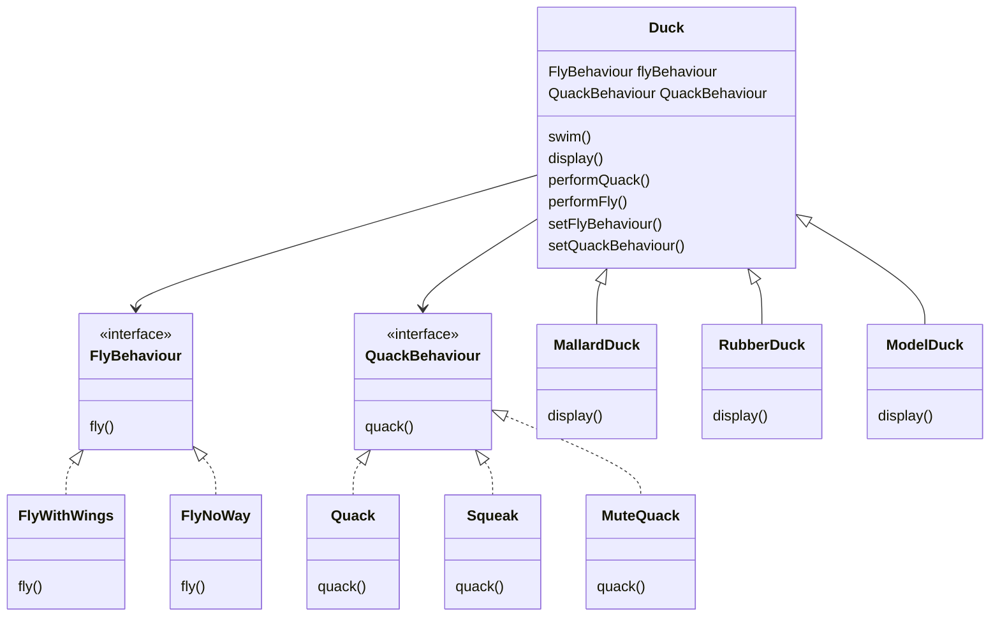

# Chapter 1: Strategy Pattern

> **The Strategy Pattern** defines a family of algorithms, encapsulates each one, and makes them interchangeable. Strategy lets the algorithm vary independently from clients that use it.

## Problem Statement

Joe works for a company that makes a highly successful duck pond simulation game, *SimUDuck*. The game has different types of ducks (Mallard, Rubber, Model, etc.) each with different behaviours (quacking, flying, etc.). 

Instead of creating separate classes for each type of duck and duplicating code for each behaviour, the proposed solution involves incorporating the Strategy pattern. This patterns encapsulates the behaviours as separate classes and allow them to be dynamically interchangeable at runtime.

This approach allows for greater flexibility and maintainability in the code, as well as easier extensibility for future changes or additions to the behaviour of the duck.


## Class Diagram



## Implementation

The approach taken in `SimUDuck.py` consists of two classes to represent the behaviours of the duck: `FlyBehaviour` and `QuackBehaviour`. Both of these classes have child classes which implement the specifc *flying* and *quacking* behaviours.

The `Duck` class, declares two variables for the behaviour types (i.e. `_fly_behaviour` and `_quack_behaviour`) so that we can define these for all the duck variations.

The `MiniDuckSimulator()` function creates instances of `MallardDuck` and `ModelDuck`, and demonstrates how ducks can have different fly behaviours.

## Usage

```shell
python3 duck.py
```